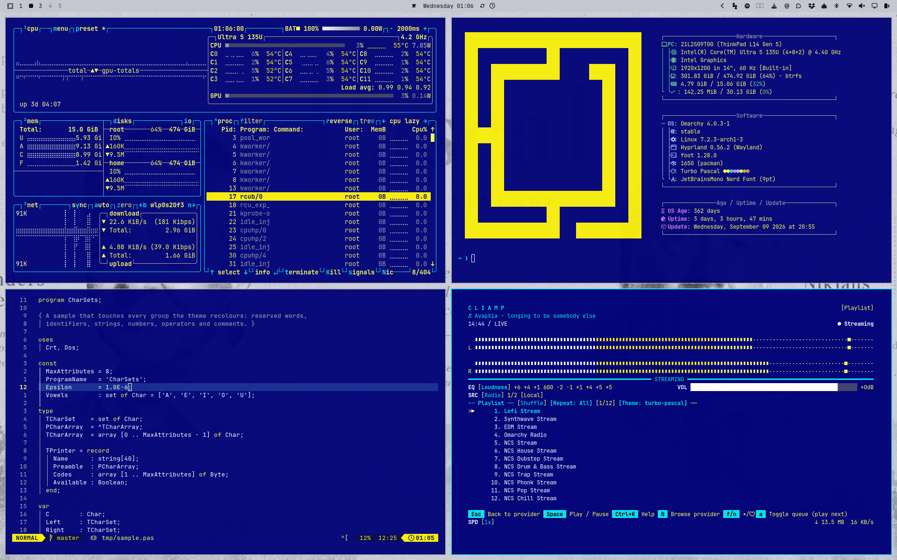
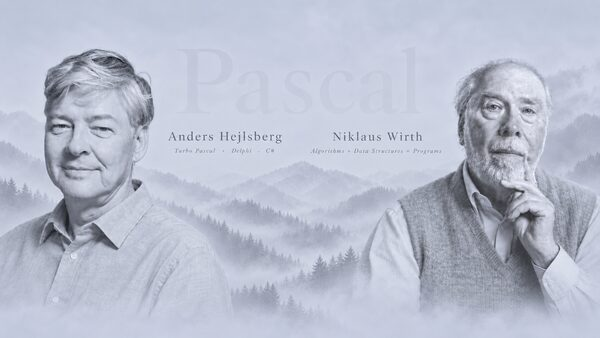
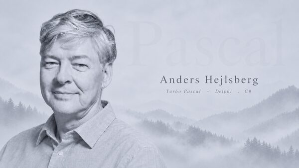
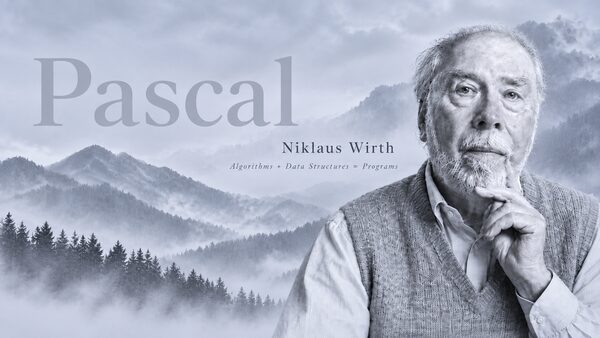

# omarchy-turbo-pascal-theme



A dark Omarchy theme built from Borland's Turbo Pascal: the blue editor
field, the grey menu bar, the cyan frame.

Turbo Pascal was my first language on the PC, after assembler and BASIC on a
C64 and CP/M on a CPC 464. I loved Turbo Pascal, and I still know exactly
what that screen looked like. Hence this theme.

## Installation

```bash
omarchy theme install https://github.com/AlexZeitler/omarchy-turbo-pascal-theme
```

## Screenshots

Click a thumbnail to open the wallpaper in full resolution.

### Hejlsberg and Wirth

[](backgrounds/01-hejlsberg-and-wirth.png)

### Anders Hejlsberg

[](backgrounds/02-hejlsberg.png)

### Niklaus Wirth

[](backgrounds/03-wirth.png)

## What Hejlsberg and Wirth built

Anders Hejlsberg wrote Turbo Pascal in assembly, and version 3.0 shipped as a
single 39 KB executable: editor, single-pass compiler and runtime, all inside
those 39 kilobytes. No linker, no object files, nothing written to disk. It
compiled straight into memory and ran, and an error put the cursor on the
line. It cost $49.95 when a compiler cost several hundred. Then Delphi. Then
C#. Then TypeScript. Four times he built the thing a generation wrote its
code in, and the thread from that one floppy runs straight into what most of
us typed this morning.

Niklaus Wirth designed the language, and then kept building: Modula-2,
Oberon, and with Oberon a complete operating system with its compiler and
window system, small enough to read end to end. He designed the workstation
it ran on as well. Turing Award in 1984. He died in January 2024.

## Palette

| Role       | Colour    | Source in the IDE          |
|------------|-----------|----------------------------|
| Background | `#010378` | the editor field           |
| Surfaces   | `#152B92` | selection, cursor line     |
| Foreground | `#FFFF55` | the editor text            |
| Emphasis   | `#FFFFFF` | reserved words             |
| Muted      | `#AAAAAA` | comments, the menu bar     |
| Accent     | `#0BDFEA` | window frames, scrollbars  |
| Highlight  | `#F7EE0B` | the selection bar          |

The active window border is a gradient from the frame cyan to its lighter
step, set through `hyprland_active_border` in `colors.toml`.

## Extras (optional)

The theme works as installed. The pieces below reach programs Omarchy does not
theme, and each needs one step from you. Omarchy refuses to run anything a
cloned theme brings along on its own, so none of them installs automatically.

All five apply to every theme, not only to this one. The lazygit template acts
for any theme; the others do nothing unless the current theme asks for them.
Only one file can sit under each name, so installing the same extra from
another theme replaces this one.

The commands copy rather than link. A copy keeps working after the theme is
removed, but it does not follow an update: run the command again after
`omarchy theme update`.

### Neovim

`aether.nvim` spreads code over the full palette. The template folds it back to
three colours: reserved words in the foreground colour, everything else in the
bright one, comments in the muted one. It also puts floats, the completion menu
and the sidebars back on the editor field, and gives blink.cmp a frame. It acts
only when the current theme ships `neovim.syntax` containing `three-colour`.

```bash
mkdir -p ~/.config/omarchy/themed
cp ~/.config/omarchy/themes/turbo-pascal/themed/neovim.lua.tpl \
  ~/.config/omarchy/themed/
omarchy theme set turbo-pascal
```

To remove it:

```bash
rm ~/.config/omarchy/themed/neovim.lua.tpl
omarchy theme set turbo-pascal
```

### lazygit

lazygit keeps each line's own colour on the selected row, and its default bar
is the ANSI blue slot. This theme keeps that slot light for directory names,
so the row turns light on light. The template gives the bar the theme's
lifted background instead. lazygit reads it as a second config file:

```bash
mkdir -p ~/.config/omarchy/themed
cp ~/.config/omarchy/themes/turbo-pascal/themed/lazygit.yml.tpl \
  ~/.config/omarchy/themed/
omarchy theme set turbo-pascal
```

Then add this to `~/.bashrc` and open a new shell. lazygit refuses to start if
a file in `LG_CONFIG_FILE` is missing, so the snippet lists only files that
exist:

```bash
lg_files=()
for f in "${XDG_CONFIG_HOME:-$HOME/.config}/lazygit/config.yml" \
         "$HOME/.local/state/omarchy/current/theme/lazygit.yml"; do
  [[ -f $f ]] && lg_files+=("$f")
done
(( ${#lg_files[@]} )) && export LG_CONFIG_FILE=$(IFS=,; echo "${lg_files[*]}")
unset lg_files f
```

Inside Neovim, snacks.nvim adds its own theme file after these two, so the
editor's colours win there. To remove it, delete the template and the snippet:

```bash
rm ~/.config/omarchy/themed/lazygit.yml.tpl
omarchy theme set turbo-pascal
```

### GTK

GTK reads `~/.config/gtk-3.0/gtk.css` and `~/.config/gtk-4.0/gtk.css` and
nothing else, so Omarchy's `gtk.css` never reaches Nautilus or the GTK file
dialogs. The hook writes the theme's block into both files between its own
markers, and removes it again for a theme without a `gtk.css`. Anything you
wrote into those files yourself survives.

```bash
omarchy hook install theme-set ~/.config/omarchy/themes/turbo-pascal/hooks/gtk
omarchy theme set turbo-pascal
```

To remove it:

```bash
~/.config/omarchy/hooks/theme-set.d/gtk --remove
rm ~/.config/omarchy/hooks/theme-set.d/gtk
```

### cliamp

`cliamp` reads its own directory, `~/.config/cliamp/themes/`. The hook copies
`cliamp.toml` there under the name of the current theme and selects it, also
in a running instance. Before its first write it backs up
`~/.config/cliamp/config.toml`; a theme without a `cliamp.toml` restores it.

```bash
omarchy hook install theme-set \
  ~/.config/omarchy/themes/turbo-pascal/hooks/cliamp
omarchy theme set turbo-pascal
```

To remove it:

```bash
~/.config/omarchy/hooks/theme-set.d/cliamp --remove
rm ~/.config/omarchy/hooks/theme-set.d/cliamp
```

### fastfetch

The hook sets the logo colour from `fastfetch.json` and touches nothing else.
It needs `jq` and a user configuration, because the one under `/etc` belongs to
the package:

```bash
mkdir -p ~/.config/fastfetch
cp /etc/fastfetch/config.jsonc ~/.config/fastfetch/
omarchy hook install theme-set \
  ~/.config/omarchy/themes/turbo-pascal/hooks/fastfetch
omarchy theme set turbo-pascal
```

Before its first write the hook backs up the configuration; a theme without a
`fastfetch.json` restores it. To remove it:

```bash
~/.config/omarchy/hooks/theme-set.d/fastfetch --remove
rm ~/.config/omarchy/hooks/theme-set.d/fastfetch
```

## License

MIT
